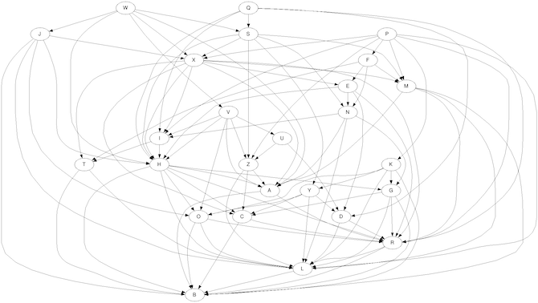

# Day 7: The Sum of Its Parts

https://adventofcode.com/2018/day/7

## Challenges
You must help us assemble this 'sleigh' at once!" They start excitedly pulling more parts out of the box. The instructions specify a series of steps and requirements about which steps must be finished before others can begin (your puzzle input). Each step is designated by a single letter.

* A: In what order should the steps in your instructions be completed?
* B: With 5 workers and the 60+ second step durations, how long will it take to complete all of the steps?

## Sample Input
```
Step C must be finished before step A can begin.
Step C must be finished before step F can begin.
Step A must be finished before step B can begin.
Step A must be finished before step D can begin.
Step B must be finished before step E can begin.
Step D must be finished before step E can begin.
Step F must be finished before step E can begin.
```

Visually, these requirements look like this:

```
  -->A--->B--
 /    \      \
C      -->D----->E
 \           /
  ---->F-----
```

## Input Visualised

With minor transformation I changed input to input.dot and used graphviz to produce an image of the connections as:



## Result
### rust
```
% target/release/aoc201807
A: PFKQWJSVUXEMNIHGTYDOZACRLB

% hyperfine --warmup 3 'target/release/aoc201807'
Benchmark #1: target/release/aoc201807
  Time (mean ± σ):      17.5 ms ±   2.4 ms    [User: 1.4 ms, System: 1.4 ms]
  Range (min … max):    15.4 ms …  28.8 ms
```
